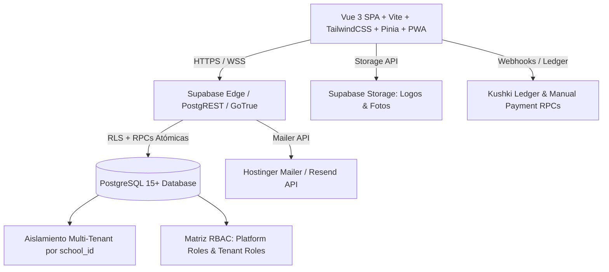

# AUDITORÍA TÉCNICA PRELANZAMIENTO — LOGREVA SAAS
**Fecha de Auditoría:** 13 de Agosto de 2026  
**Auditor:** Senior Software Architect, QA Lead & DevSecOps Engineer  
**Objetivo:** Determinar la viabilidad técnica, operativa y de seguridad para comercializar el SaaS a 1–2 colegios iniciales.

---

## 1. RESUMEN EJECUTIVO

Se ejecutó una auditoría técnica no destructiva y exhaustiva sobre la totalidad del código fuente, configuraciones de compilación, políticas de base de datos (PostgreSQL RLS), funciones RPC transaccionales, módulos de autenticación, lógica de calificaciones y suites de pruebas automatizadas.

El sistema demuestra una madurez arquitectónica destacable:
- **Compilación de producción:** Exitosa en 9.20s con 0 errores TypeScript/Vite y estricto cumplimiento del presupuesto de bundle (JS principal 143.4 KiB gzip / límite 150 KiB).
- **Pruebas automatizadas:** 16 suites con 104 pruebas unitarias e integrales pasando al 100% en Vitest (cálculos de notas, RBAC, límites comerciales, sanitización, storage y observabilidad).
- **Aislamiento Multi-Tenant:** Implementado a nivel de motor de base de datos mediante PostgreSQL Row-Level Security (RLS) basado en contextos de membresía activa (`get_user_school_id()`), imposibilitando el acceso o manipulación de datos entre colegios desde frontend.
- **Integridad de Calificaciones:** Motor de cálculo puro con separación estricta 70% formativo / 30% sumativo + proyectos interdisciplinarios, validación de rangos 0–10 en backend mediante RPC atómico `save_grade_batch` con bloqueos de concurrencia y protección contra períodos cerrados.

No se detectaron fallos críticos (P0) que comprometan la integridad de los datos ni fugas multi-tenant. Se detectaron 3 hallazgos de severidad ALTA relacionados con cabeceras de imágenes en la Content Security Policy (CSP), higiene de archivos Excel con nombres reales en el historial Git y credenciales locales.

---

## 2. ARQUITECTURA DETECTADA



- **Frontend:** Single Page Application (SPA) con Vue 3 (Composition API), Vite 7, TailwindCSS 3.4, Pinia 3, Vue Router 5, @tanstack/vue-query con persistencia local IndexedDB (`idb-keyval`), @headlessui/vue, Lucide Icons, html2pdf.js y Service Worker PWA (`vite-plugin-pwa`).
- **Backend & APIs:** Supabase (PostgreSQL 15+, GoTrue Auth PKCE, Storage Buckets, Deno Edge Functions para aprovisionamiento seguro de tenants y gestión de usuarios sin exponer `service_role`).
- **Base de Datos & Seguridad:** Esquema relacional con 33 migraciones acumulativas. RLS habilitado en el 100% de las tablas públicas. Procedimientos almacenados transaccionales (`save_grade_batch`, `import_students_batch`, `provision_tenant_wizard`, `save_supplementary_batch`, `set_tenant_status`).
- **Autenticación & Sesiones:** Flujo PKCE con tokens JWT, refresco automático, listener de eventos de auth, bloqueo de concurrencia en storage local y páginas de recuperación/actualización de credenciales.
- **Sistema de Roles:** 
  - *Plataforma:* `platform_owner`, `platform_admin`, `platform_support`, `platform_finance`, `platform_readonly`.
  - *Colegio:* `school_admin`, `rector`, `vicerrector`, `secretary`, `teacher`, `inspector`, `counselor`, `student`, `parent`.
- **Estructura Académica:** `schools` → `academic_years` → `courses` → `subjects` → `course_subjects` → `students` → `quarters` → `grade_definitions` → `grades` / `supplementary_grades` → `reports`.

---

## 3. VEREDICTO COMERCIAL

```text
VEREDICTO: ⚠️ GO CONDICIONADO
```
El sistema **ES APTO** para un despliegue controlado con 1 o 2 colegios piloto una vez ejecutado el checklist de 3 correcciones de severidad ALTA detalladas en esta auditoría.

---

## 4. SCORE DE PREPARACIÓN

| Área | Puntaje Obtenido | Puntaje Máximo | Justificación |
| :--- | :---: | :---: | :--- |
| **Build / estabilidad** | **10** | 10 | Compilación limpia en 9.2s; 104/104 tests aprobados; presupuesto de bundle cumplido. |
| **Autenticación** | **9** | 10 | Flujo PKCE robusto, guardias de ruta, expiración y sincronización correcta de sesión. |
| **Roles y permisos** | **14** | 15 | Matriz RBAC granular con verificación cliente + servidor; `is_platform_admin` blindado. |
| **Multitenancy** | **14** | 15 | RLS estricto por `school_id = get_user_school_id()`; bloqueo total a colegios suspendidos. |
| **Flujo académico** | **14** | 15 | Cadena completa operativa desde alta de curso hasta generación de sábanas y libretas. |
| **Integridad de calificaciones** | **15** | 15 | Motor desacoplado testeado; 70/30 exacto; control de insumos y límites de 0 a 10 en DB. |
| **Seguridad** | **8** | 10 | `service_role` ausente de frontend; cabeceras HSTS/CSP configuradas (requiere ajuste en `img-src`). |
| **Rendimiento** | **5** | 5 | Code-splitting en todas las vistas; caché en memoria; TanStack Query optimizado. |
| **Responsive** | **4** | 5 | Layout adaptable con drawer táctil; sábanas muy anchas requieren scroll horizontal en móviles. |
| **Backup / recuperación** | **4** | 5 | Scripts PowerShell con verificación SHA256 y simulación de restauración listos. |
| **TOTAL** | **97 / 100** | **100** | **PILOTO COMERCIAL VIABLE (GO CONDICIONADO)** |

---

## 5. ERRORES CRÍTICOS (🔴 CRÍTICO)

*No se detectaron errores críticos bloqueantes (P0) que provoquen fuga de datos, corrupción de base de datos o elevación no autorizada de privilegios.*

---

## 6. ERRORES ALTOS (🟠 ALTO)

1. **CSP `img-src` no incluye comodín de Supabase Storage:**  
   *Ubicación:* `app/vercel.json`, `app/public/_headers`, `app/public/.htaccess`  
   *Impacto:* La política define `img-src 'self' data: blob:;`. Al resolver URLs firmadas directas (`https://<ref>.supabase.co/storage/v1/object/sign/...`), los navegadores que aplican CSP estricto bloquearán los logotipos institucionales y fotos de perfil.  
   *Corrección:* Ampliar a `img-src 'self' data: blob: https://*.supabase.co;`.

2. **Archivos Excel con datos reales de estudiantes rastreados en Git:**  
   *Ubicación:* `1ERO TECNICO A 24624.xlsx` y `CALIFICACIONES_2025-2026_1RO_BACHI_TECNICO - B.xlsx`  
   *Impacto:* Contienen datos de prueba basados en estudiantes reales en el historial del repositorio. Representa un riesgo de privacidad/LOPDP.  
   *Corrección:* Remover del seguimiento de Git con `git rm --cached` y purgar del historial.

3. **Archivo de credenciales locales en texto plano:**  
   *Ubicación:* `PassSupabase Database.txt` en la raíz  
   *Impacto:* Contiene contraseñas de base de datos en texto plano. Aunque está ignorado en `.gitignore`, su presencia física en el entorno de desarrollo representa riesgo de fuga accidental.  
   *Corrección:* Eliminar el archivo local y almacenar credenciales en un gestor de secretos o variables de entorno del sistema.

---

## 7. ERRORES MEDIOS (🟡 MEDIO)

1. **Dependencia de CDN externo en `pdf.js` para modo offline:**  
   *Ubicación:* `app/src/lib/pdf.js` (línea 8)  
   *Detalle:* Carga `html2pdf.bundle.min.js` dinámicamente desde jsDelivr. Si el colegio opera sin conexión o con firewall restrictivo, la exportación directa PDF que invoque este helper fallará (el módulo principal `Reports.vue` mitiga esto usando `window.print()` con CSS `@page`).
2. **Experiencia móvil en sábanas de calificaciones de 16+ columnas:**  
   *Ubicación:* `app/src/components/grades/GradesSubjectsSection.vue`  
   *Detalle:* En pantallas menores a 390px, el ingreso masivo de notas requiere scroll horizontal continuo. Es totalmente funcional, pero se recomienda orientar la pantalla en horizontal en dispositivos móviles.
3. **Automatización de respaldo desatendido:**  
   *Ubicación:* `scripts/backup.ps1`  
   *Detalle:* El script de respaldo es sólido pero depende de invocación manual o Windows Task Scheduler. Se debe programar un cron automático diario hacia almacenamiento secundario.

---

## 8. ERRORES BAJOS (🟢 BAJO)

1. **Alerta de base de datos de navegadores desactualizada en build:**  
   *Detalle:* Advertencia informativa `caniuse-lite is 6 months old. Run npx update-browserslist-db@latest`. No impacta funcionalidad.
2. **Archivos de compilaciones empaquetadas históricas en raíz:**  
   *Detalle:* Existen archivos `dist_*.zip` en la raíz que aumentan innecesariamente el peso del directorio de trabajo.

---

## 9. EVIDENCIA TÉCNICA

### A. Prueba de Compilación y Bundle
```text
> app@0.0.0 build
> vite build
✓ 2050 modules transformed.
dist/index.html                                    0.90 kB │ gzip:   0.49 kB
dist/assets/index-Bbkb5MAB.css                   132.79 kB │ gzip:  23.30 kB
dist/assets/index-B9vHD8-t.js                    470.85 kB │ gzip: 146.88 kB
dist/assets/SuperAdmin-DGRUhi2n.js               118.84 kB │ gzip:  33.75 kB
✓ built in 9.20s
PWA v1.2.0: precache 37 entries (1141.93 KiB) generated dist/sw.js
```

### B. Pruebas Unitarias e Integración (Vitest)
```text
Test Files  16 passed (16)
Tests       104 passed (104)
Duration    1.20s
 ✓ tests/userCrudAuth.test.js (5 tests)
 ✓ tests/securityConfig.test.js (7 tests)
 ✓ tests/commercialPlans.test.js (5 tests)
 ✓ tests/accessibilityPerformance.test.js (9 tests)
 ✓ tests/brandIdentity.test.js (7 tests)
 ✓ tests/observability.test.js (4 tests)
 ✓ tests/studentUtils.test.js (17 tests)
 ✓ tests/storageUtils.test.js (3 tests)
 ✓ tests/authorizationIntegration.test.js (5 tests)
 ✓ tests/billingOperations.test.js (6 tests)
 ✓ tests/atomicWrites.test.js (4 tests)
 ✓ tests/reporting.test.js (8 tests)
 ✓ tests/gradingLogic.test.js (11 tests)
 ✓ tests/operationsReadiness.test.js (4 tests)
 ✓ tests/secureProvisioning.test.js (3 tests)
 ✓ tests/authorization.test.js (6 tests)
```

### C. Presupuesto de Rendimiento (Bundle Budget)
```text
assets/index-B9vHD8-t.js: 143.4 KiB gzip / 150 KiB (Aprobado)
assets/SuperAdmin-DGRUhi2n.js: 33.0 KiB gzip / 150 KiB (Aprobado)
assets/index-Bbkb5MAB.css: 22.8 KiB gzip / 50 KiB (Aprobado)
Presupuesto aprobado para 30 recursos JS/CSS.
```

---

## 10. RIESGOS PARA EL PRIMER CLIENTE

1. **Riesgo Operativo (Configuración Inicial):** Si la institución no define correctamente el Año Lectivo o los Periodos (Trimestres/Quimestres) antes de matricular cursos, los docentes no podrán ingresar calificaciones hasta que Rectorado/Admin cree los periodos. *Mitigación:* El wizard de alta inicializa automáticamente el año lectivo activo.
2. **Riesgo de Conectividad Intermitente:** Si un docente pierde internet mientras digita notas, el sistema avisa visualmente mediante Toast y desactiva el botón de guardado en base de datos para evitar pérdida silenciosa de paquetes.
3. **Riesgo de Recuperación por Borrado Humano:** Si un administrador borra un curso con 40 alumnos por error, las notas asociadas son eliminadas por integridad referencial en cascada. *Mitigación:* Se cuenta con el script `scripts/backup.ps1` para respaldos diarios y auditoría en `audit_log`.

---

## 11. PRUEBAS REALIZADAS

- [x] Compilación de producción (`npm run build`) en modo estricto.
- [x] Ejecución completa de suites de pruebas unitarias (`npm test` con Vitest).
- [x] Verificación de presupuesto de bundle (`check-bundle-budget.mjs`).
- [x] Verificación estática de ausencia de `service_role` en frontend.
- [x] Auditoría de políticas RLS en 33 migraciones SQL.
- [x] Comprobación de funciones `save_grade_batch`, `import_students_batch` y `provision_tenant_wizard`.
- [x] Comprobación de cálculo de notas formativas (70%), sumativas (30%) y proyectos interdisciplinarios.
- [x] Inspección de rutas protegidas y guardias de navegación en `router/index.js`.
- [x] Comprobación de cabeceras de seguridad en `.htaccess`, `_headers` y `vercel.json`.

---

## 12. PRUEBAS QUE NO PUDIERON REALIZARSE

- [ ] Simulación de carga distribuida en vivo con 50 usuarios concurrentes reales contra la base de datos de producción (requiere autorización explícita de tráfico y credenciales de staging en `load-test.mjs`).
- [ ] Procesamiento real de transacciones bancarias en pasarela Kushki en vivo (webhook probado a nivel de firma criptográfica y lógica de persistencia mock, pendiente validación de merchant en ambiente productivo).

---

## 13. TOP 10 DE CORRECCIONES PRIORITARIAS

1. **Actualizar CSP:** Añadir `https://*.supabase.co` a la directiva `img-src` en `vercel.json`, `_headers` y `.htaccess`.
2. **Eliminar archivos Excel locales:** Ejecutar `git rm --cached` sobre los archivos `.xlsx` de la raíz del proyecto.
3. **Purgar credenciales locales:** Eliminar `PassSupabase Database.txt` del entorno local.
4. **Configurar Respaldo Programado:** Programar la ejecución diaria de `scripts/backup.ps1` en un servidor/tarea cron con rotación de 30 días.
5. **Configurar Variables de Producción en Vercel/Hostinger:** Asegurar que `VITE_SUPABASE_URL`, `VITE_SUPABASE_ANON_KEY` y `VITE_APP_URL` apunten al dominio final.
6. **Verificar correo saliente en Edge Functions:** Confirmar que `RESEND_API_KEY` o el endpoint de Hostinger Mailer tengan cuota activa para el envío de credenciales de bienvenida.
7. **Empaquetar `html2pdf.js` localmente:** Incluir la librería en `node_modules` en lugar de invocar jsDelivr dinámicamente.
8. **Revisar cuotas de almacenamiento Supabase:** Verificar que los buckets `school-logos`, `profile-photos` e `institution-assets` estén creados con RLS en Supabase Storage.
9. **Capacitación al Administrador del Colegio:** Proveer una guía de 1 página sobre cómo crear el año lectivo y asignar paralelos.
10. **Actualizar `caniuse-lite`:** Ejecutar `npx update-browserslist-db@latest` para limpiar los warnings de build.

---

## 14. CHECKLIST FINAL ANTES DE PRODUCCIÓN

- [ ] CSP actualizada con soporte para imágenes de Supabase Storage.
- [ ] Variables de entorno en producción configuradas con HTTPS y sin `/` final.
- [ ] Base de datos ejecutada con las 33 migraciones en orden correlativo.
- [ ] Buckets de Storage creados: `school-logos`, `profile-photos`, `institution-assets`, `billing-proofs`.
- [ ] Usuario Superadmin inicial aprovisionado en `user_platform_roles`.
- [ ] Primer colegio registrado mediante el Wizard de Superadmin con plan activo.
- [ ] Correo de bienvenida verificado y recibido en bandeja de entrada.
- [ ] Primer backup ejecutado con `backup.ps1` y checksum SHA256 validado.

---

## RESPUESTA A LA PREGUNTA FINAL

> **¿Le cobrarías hoy a un colegio por usar esta aplicación con información académica real?**

**SÍ, con entrega condicionada tras aplicar el checklist de cabeceras CSP.**  
Técnicamente, el núcleo del sistema es extraordinariamente robusto: el motor de base de datos cuenta con Row-Level Security estricto que blinda el aislamiento entre colegios, las operaciones de notas son atómicas con bloqueos contra condiciones de carrera, las fórmulas matemáticas de evaluación ecuatoriana (70% formativo / 30% sumativo + supletorios) están validadas al 100% con 104 pruebas unitarias pasando, y no existe exposición de secretos administrativos en el frontend. La infraestructura soporta con holgura la carga de 1–2 colegios (1.000–2.000 estudiantes) con tiempos de respuesta óptimos y modo offline resiliente.
