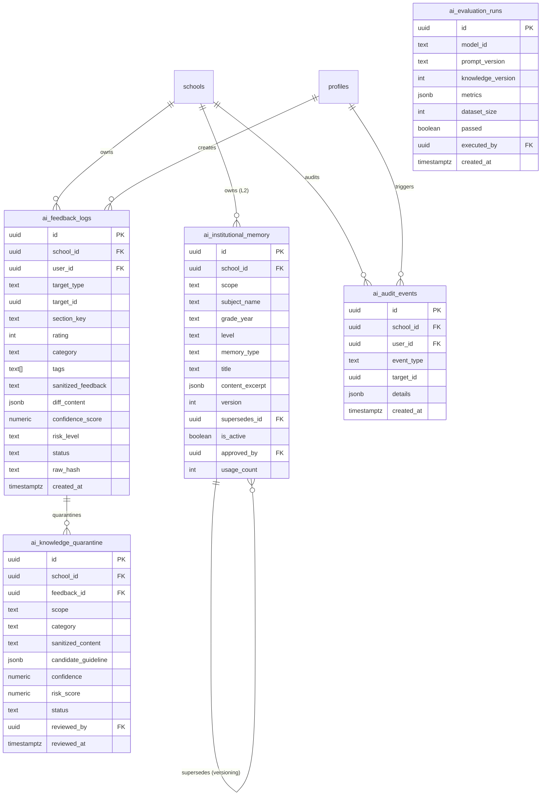

# DATABASE: Esquema y Persistencia del Sistema de Feedback y Memoria de IA

**Fecha:** 2026-09-03  
**Proyecto:** LOGREVA (WebNotasApp)  
**Motor:** PostgreSQL 15+ / Supabase  

---

## 1. Tablas Nuevas y Justificación Técnica

Para satisfacer el requerimiento de cuarentena estricta, versionado, RAG y auditoría sin duplicar entidades existentes:

1. **`public.ai_feedback_logs`**:
   Registra cada interacción de retroalimentación de los docentes (calificación, categoría rápida, comentario sanitizado y diff estructurado cuando editan manualmente el documento).
2. **`public.ai_knowledge_quarantine`**:
   Zona de aislamiento donde reposa todo contenido o sugerencia candidata antes de ser evaluada o aprobada. **Ningún registro aquí puede ser consultado por el RAG.**
3. **`public.ai_institutional_memory`**:
   Base de conocimiento validada y versionada. Contiene los lineamientos institucionales y ejemplos dorados (*Golden Samples*) que alimentan el RAG con aislamiento multi-tenant.
4. **`public.ai_evaluation_runs`**:
   Historial de ejecuciones de pruebas de calidad del sistema generativo contra el Golden Dataset curricular.
5. **`public.ai_audit_events`**:
   Log inmutable de eventos de auditoría para trazabilidad de cambios en prompts, promociones de conocimiento y revisiones de cuarentena.

---

## 2. Diagrama Entidad-Relación (Mermaid)

---

## 3. Políticas de Seguridad RLS (Row Level Security)

* **`ai_feedback_logs`**:
  - `SELECT`: Administrador de la escuela o el docente autor (`school_id = get_user_school_id() AND (is_admin() OR user_id = auth.uid())`).
  - `INSERT`: Usuarios autenticados de la institución con rate limiting validado en la función RPC `submit_ai_feedback`.
* **`ai_knowledge_quarantine`**:
  - `SELECT / UPDATE`: Exclusivo para administradores institucionales o SuperAdmins (`school_id = get_user_school_id() AND is_admin()`).
* **`ai_institutional_memory`**:
  - `SELECT`: Miembros de la institución (`school_id = get_user_school_id() OR scope = 'global'`) donde `is_active = true`.
  - `INSERT / UPDATE / DELETE`: Exclusivo para administradores de la institución o SuperAdmin.
* **`ai_audit_events`**:
  - Inmutable. Solo `INSERT` autorizado vía funciones de base de datos (`SECURITY DEFINER`).

---

## 4. Índices de Alto Rendimiento

* `CREATE INDEX idx_ai_feedback_target ON public.ai_feedback_logs(target_id, target_type);`
* `CREATE INDEX idx_ai_feedback_school_status ON public.ai_feedback_logs(school_id, status);`
* `CREATE INDEX idx_ai_quarantine_school_status ON public.ai_knowledge_quarantine(school_id, status);`
* `CREATE INDEX idx_ai_memory_retrieval ON public.ai_institutional_memory(school_id, subject_name, level, is_active);`
* `CREATE INDEX idx_ai_audit_school_event ON public.ai_audit_events(school_id, event_type, created_at DESC);`
